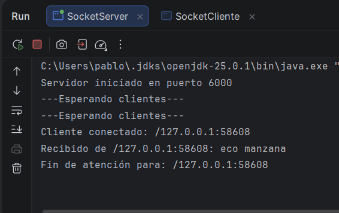
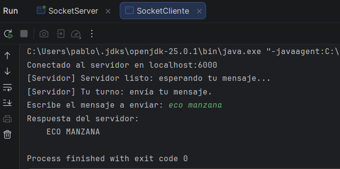
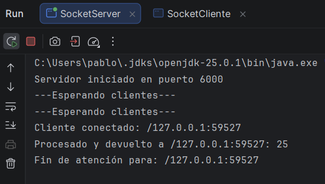
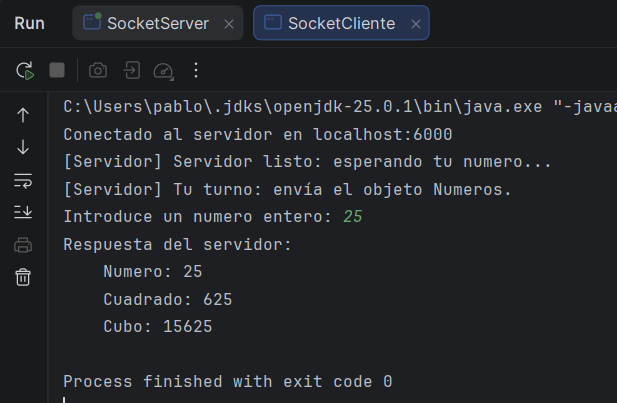

# Sockets & Dragons

Repositorio de prácticas de **PSP (Programación de Servicios y Procesos)**.

## Integrantes del grupo

- Pablo: Coder Principal, Arquitecto/a de Red, Cazador de Bugs.
- Miguel Ángel Varo: Coder Principal, Arquitecto/a de Red.
- Manuel Cañas: Cronista, Coder Principal.

---

## Estructura del repositorio

- [`Socket_Dragons_TCP_VPM/`](./Socket_Dragons_TCP_VPM) → Mensajes UTF (`DataInputStream/DataOutputStream`)
- [`Socket_Dragons_Oraculo_VPM/`](./Socket_Dragons_Oraculo_VPM) → Objetos (`ObjectInputStream/ObjectOutputStream`)

---

## Contexto

En esta entrega trabajamos con **sockets TCP en Java**.

Hay dos mini-proyectos independientes:

1) **Socket_Dragons_TCP_VPM** → comunicación por `DataInputStream/DataOutputStream` usando `readUTF()` / `writeUTF()`.
2) **Socket_Dragons_Oraculo_VPM** → comunicación por `ObjectInputStream/ObjectOutputStream` enviando un objeto `Numeros` (Serializable).

Cada proyecto incluye:
- **Servidor**
- **Clientes** (para probar cola/turno y respuestas)

---

## 1) Socket_Dragons_TCP_VPM

Carpeta: [`Socket_Dragons_TCP_VPM/`](./Socket_Dragons_TCP_VPM)

### Objetivo

- Practicar una comunicación TCP sencilla.
- El servidor recibe un mensaje (UTF) y lo devuelve en **MAYÚSCULAS**.
- El servidor controla:
  - **Turnos** (solo atiende a 1 cliente a la vez)
  - **Cola con timeout**
  - **Timeout por inactividad (AFK)**
  - Validación básica para no aceptar mensajes vacíos o demasiado largos

### Estructura (carpeta `Socket_Dragons_TCP_VPM/src`)

- `SocketServer.java` → servidor con cola/turnos.
- `SocketCliente.java` → cliente por consola.
- `SocketCliente2.java` → segundo cliente.
- `SocketClienteDemoQA.java` → demo para ver cola/turnos.
- `SocketClienteQA_CargaControlada.java` → demo "QA" con comportamientos aleatorios (desconexiones, vacío, lento).

### Evidencias

**Servidor TCP (eco a mayúsculas):**

**Cliente TCP (eco a mayúsculas):**

### Clientes de debug

En este proyecto hay clientes "extra" pensados para **demostrar** y **comprobar** que la cola y los timeouts funcionan.

- `SocketClienteDemoQA.java`
  - Qué hace:
    - Lanza varios clientes casi a la vez.
    - Muestra por consola los mensajes del servidor (cola → turno).
    - Si `Afk=true`, el último cliente no envía y se ve la expulsión por inactividad.

- `SocketClienteQA_CargaControlada.java`
  - Qué hace (elige aleatoriamente por cliente):
    - Conectar y desconectar inmediatamente.
    - Desconectar mientras está en cola.
    - Enviar mensaje vacío (el servidor lo marca como inválido).
    - Enviar mensaje normal y comprobar el eco a mayúsculas.
    - Esperar demasiado antes de enviar para provocar expulsión por inactividad (AFK) en el servidor.

---

## 2) Socket_Dragons_Oraculo_VPM

Carpeta: [`Socket_Dragons_Oraculo_VPM/`](./Socket_Dragons_Oraculo_VPM)

### Objetivo

- Practicar envío de objetos por sockets usando **serialización**.
- El cliente envía un objeto `Numeros` con un entero.
- El servidor calcula:
  - `cuadrado = n * n`
  - `cubo = n * n * n`
- Devuelve el mismo objeto con los resultados.
- El servidor usa **turnos** y **timeouts** para no quedarse bloqueado.

### Estructura (carpeta `Socket_Dragons_Oraculo_VPM/src`)

- `Numeros.java` → clase `Serializable` que viaja por la red.
- `SocketServer.java` → servidor "Oráculo".
- `SocketCliente.java` → cliente 1 por consola.
- `SocketCliente2.java` → cliente 2 por consola.
- `SocketClienteDemoQA_Oraculo.java` → demo de cola/turnos + opción de simular AFK.
- `SocketClienteQA_CargaControlada_Oraculo.java` → demo "QA" con comportamientos aleatorios (desconexiones, inválidos, lento).

### Evidencias (capturas)

**Servidor TCP (Oráculo con objetos):**

**Cliente TCP (Oráculo con objetos):**

### Clientes de debug

- `SocketClienteDemoQA_Oraculo.java`
  - Qué hace:
    - Lanza varios clientes casi a la vez.
    - Muestra mensajes del servidor (cola → turno).
    - Si `demoAfk=true`, el último cliente no envía el objeto tras "Tu turno" y se ve la expulsión por inactividad.

- `SocketClienteQA_CargaControlada_Oraculo.java`
  - Qué hace (elige aleatoriamente por cliente):
    - Conectar y desconectar inmediatamente.
    - Desconectar mientras está en cola.
    - Enviar un `Numeros` válido y validar cuadrado/cubo.
    - Enviar un objeto inválido (por ejemplo `String`) y ver la respuesta del servidor.
    - Esperar demasiado antes de enviar para provocar expulsión por inactividad (AFK) en el servidor.

---

## Presentación

- Enlace: 
